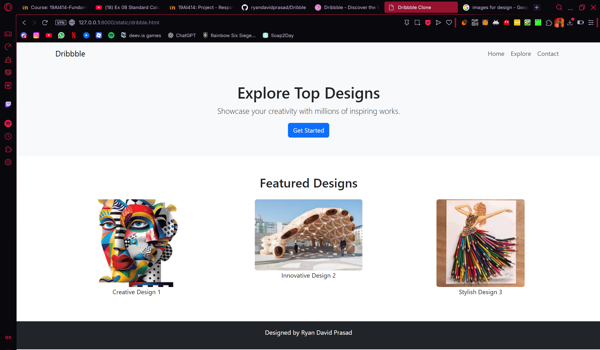
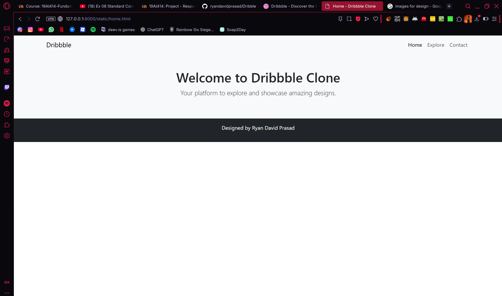
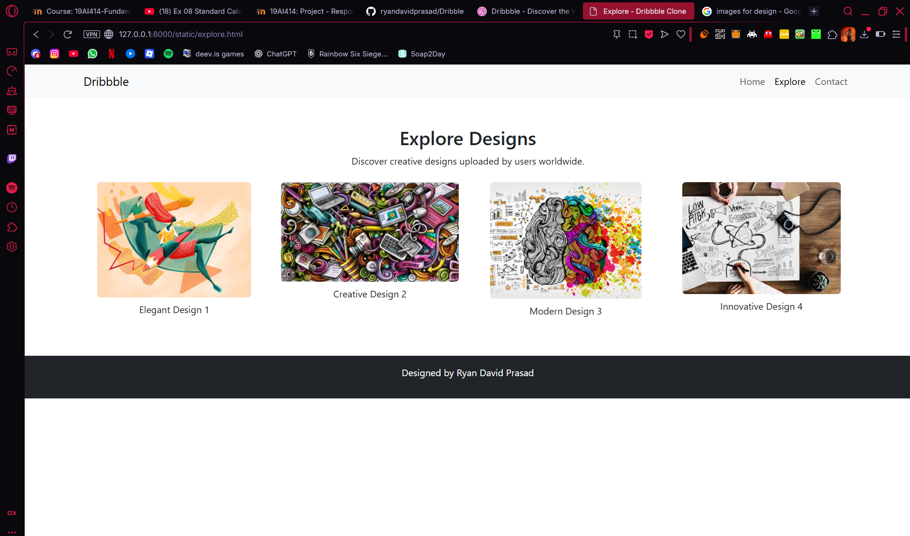
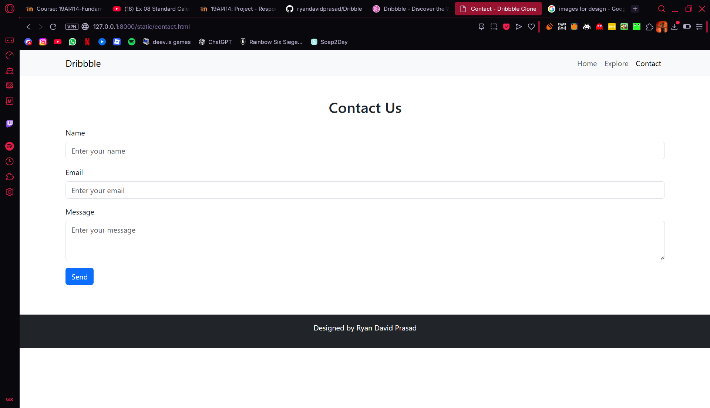

# Project Responsive Web Design using Bootstrap
## Date:16/11/25

## AIM:
To create a simplified clone of Dribbble (https://dribbble.com/) landing page.


## DESIGN STEPS:

### Step 1:
Clone the repository from GitHub.

### Step 2:
Create Django Admin project.

### Step 3:
Create a New App under the Django Admin project.

### Step 4:
Insert the necessary CSS and JavaScript files as external in order to use Bootstrap.

### Step 5:
Create a HTML file and include the needed Bootstrap components.

### Step 6:
Publish the website in the LocalHost.

## PROGRAM :
```html
dribbble.html
<html>
<head>
    <meta charset="UTF-8">
    <meta name="viewport" content="width=device-width, initial-scale=1.0">
    <title>Dribbble Clone</title>
    <!-- Bootstrap CSS -->
    <link href="https://cdn.jsdelivr.net/npm/bootstrap@5.3.0/dist/css/bootstrap.min.css" rel="stylesheet">
</head>
<body>
    <!-- Navbar -->
    <nav class="navbar navbar-expand-lg bg-light">
        <div class="container">
            <a class="navbar-brand" href="#">Dribbble</a>
            <button class="navbar-toggler" type="button" data-bs-toggle="collapse" data-bs-target="#navbarNav">
                <span class="navbar-toggler-icon"></span>
            </button>
            <div class="collapse navbar-collapse" id="navbarNav">
                <ul class="navbar-nav ms-auto">
                    <li class="nav-item"><a class="nav-link" href="home.html">Home</a></li>
                    <li class="nav-item"><a class="nav-link" href="explore.html">Explore</a></li>
                    <li class="nav-item"><a class="nav-link" href="contact.html">Contact</a></li>
                </ul>
            </div>
        </div>
    </nav>

    <!-- Hero Section -->
    <header class="bg-light text-center py-5">
        <div class="container">
            <h1>Explore Top Designs</h1>
            <p class="lead">Showcase your creativity with millions of inspiring works.</p>
            <a href="#" class="btn btn-primary">Get Started</a>
        </div>
    </header>

    <!-- Featured Section -->
    <section class="py-5">
        <div class="container text-center">
            <h2>Featured Designs</h2>
            <div class="row mt-4">
                <div class="col-md-4">
                    
                    <p>Creative Design 1</p>
                </div>
                <div class="col-md-4">
                    
                    <p>Innovative Design 2</p>
                </div>
                <div class="col-md-4">
                    
                    <p>Stylish Design 3</p>
                </div>
            </div>
        </div>
    </section>

    <!-- Footer -->
    <footer class="bg-dark text-white text-center py-3">
        <p>Designed by Ryan David Prasad</p>
    </footer>

    <!-- Bootstrap JS -->
    <script src="https://cdn.jsdelivr.net/npm/bootstrap@5.3.0/dist/js/bootstrap.bundle.min.js"></script>
</body>
</html>
home.html
<html>
<head>
    <meta charset="UTF-8">
    <meta name="viewport" content="width=device-width, initial-scale=1.0">
    <title>Home - Dribbble Clone</title>
    <!-- Bootstrap CSS -->
    <link href="https://cdn.jsdelivr.net/npm/bootstrap@5.3.0/dist/css/bootstrap.min.css" rel="stylesheet">
</head>
<body>
    <!-- Navbar -->
    <nav class="navbar navbar-expand-lg bg-light">
        <div class="container">
            <a class="navbar-brand" href="home.html">Dribbble</a>
            <button class="navbar-toggler" type="button" data-bs-toggle="collapse" data-bs-target="#navbarNav">
                <span class="navbar-toggler-icon"></span>
            </button>
            <div class="collapse navbar-collapse" id="navbarNav">
                <ul class="navbar-nav ms-auto">
                    <li class="nav-item"><a class="nav-link active" href="home.html">Home</a></li>
                    <li class="nav-item"><a class="nav-link" href="explore.html">Explore</a></li>
                    <li class="nav-item"><a class="nav-link" href="contact.html">Contact</a></li>
                </ul>
            </div>
        </div>
    </nav>

    <!-- Home Content -->
    <header class="bg-light text-center py-5">
        <div class="container">
            <h1>Welcome to Dribbble Clone</h1>
            <p class="lead">Your platform to explore and showcase amazing designs.</p>
        </div>
    </header>

    <!-- Footer -->
    <footer class="bg-dark text-white text-center py-3">
        <p>Designed by Ryan David Prasad</p>
    </footer>
</body>
</html>
explore.html
<html>
<head>
    <meta charset="UTF-8">
    <meta name="viewport" content="width=device-width, initial-scale=1.0">
    <title>Explore - Dribbble Clone</title>
    <!-- Bootstrap CSS -->
    <link href="https://cdn.jsdelivr.net/npm/bootstrap@5.3.0/dist/css/bootstrap.min.css" rel="stylesheet">
</head>
<body>
    <!-- Navbar -->
    <nav class="navbar navbar-expand-lg bg-light">
        <div class="container">
            <a class="navbar-brand" href="home.html">Dribbble</a>
            <button class="navbar-toggler" type="button" data-bs-toggle="collapse" data-bs-target="#navbarNav">
                <span class="navbar-toggler-icon"></span>
            </button>
            <div class="collapse navbar-collapse" id="navbarNav">
                <ul class="navbar-nav ms-auto">
                    <li class="nav-item"><a class="nav-link" href="home.html">Home</a></li>
                    <li class="nav-item"><a class="nav-link active" href="explore.html">Explore</a></li>
                    <li class="nav-item"><a class="nav-link" href="contact.html">Contact</a></li>
                </ul>
            </div>
        </div>
    </nav>

    <!-- Explore Content -->
    <section class="py-5">
        <div class="container text-center">
            <h2>Explore Designs</h2>
            <p>Discover creative designs uploaded by users worldwide.</p>
            
            <div class="row mt-4">
                <div class="col-md-3">
                    
                    <p class="mt-2">Elegant Design 1</p>
                </div>
                <div class="col-md-3">
                    
                    <p class="mt-2">Creative Design 2</p>
                </div>
                <div class="col-md-3">
                    
                    <p class="mt-2">Modern Design 3</p>
                </div>
                <div class="col-md-3">
                    
                    <p class="mt-2">Innovative Design 4</p>
                </div>
            </div>
        </div>
    </section>

    <!-- Footer -->
    <footer class="bg-dark text-white text-center py-3">
        <p>Designed by Ryan David Prasad</p>
    </footer>
</body>
</html>
contact.html
<html>
<head>
    <meta charset="UTF-8">
    <meta name="viewport" content="width=device-width, initial-scale=1.0">
    <title>Contact - Dribbble Clone</title>
    <!-- Bootstrap CSS -->
    <link href="https://cdn.jsdelivr.net/npm/bootstrap@5.3.0/dist/css/bootstrap.min.css" rel="stylesheet">
</head>
<body>
    <!-- Navbar -->
    <nav class="navbar navbar-expand-lg bg-light">
        <div class="container">
            <a class="navbar-brand" href="home.html">Dribbble</a>
            <button class="navbar-toggler" type="button" data-bs-toggle="collapse" data-bs-target="#navbarNav">
                <span class="navbar-toggler-icon"></span>
            </button>
            <div class="collapse navbar-collapse" id="navbarNav">
                <ul class="navbar-nav ms-auto">
                    <li class="nav-item"><a class="nav-link" href="home.html">Home</a></li>
                    <li class="nav-item"><a class="nav-link" href="explore.html">Explore</a></li>
                    <li class="nav-item"><a class="nav-link active" href="contact.html">Contact</a></li>
                </ul>
            </div>
        </div>
    </nav>

    <!-- Contact Content -->
    <section class="py-5">
        <div class="container">
            <h2 class="text-center">Contact Us</h2>
            <form class="mt-4">
                <div class="mb-3">
                    <label for="name" class="form-label">Name</label>
                    <input type="text" class="form-control" id="name" placeholder="Enter your name">
                </div>
                <div class="mb-3">
                    <label for="email" class="form-label">Email</label>
                    <input type="email" class="form-control" id="email" placeholder="Enter your email">
                </div>
                <div class="mb-3">
                    <label for="message" class="form-label">Message</label>
                    <textarea class="form-control" id="message" rows="3" placeholder="Enter your message"></textarea>
                </div>
                <button type="submit" class="btn btn-primary">Send</button>
            </form>
        </div>
    </section>

    <!-- Footer -->
    <footer class="bg-dark text-white text-center py-3">
        <p>Designed by Ryan David Prasad</p>
    </footer>
</body>
</html>

```

## OUTPUT:




## RESULT:
The Project for responsive web design using Bootstrap is completed successfully.
